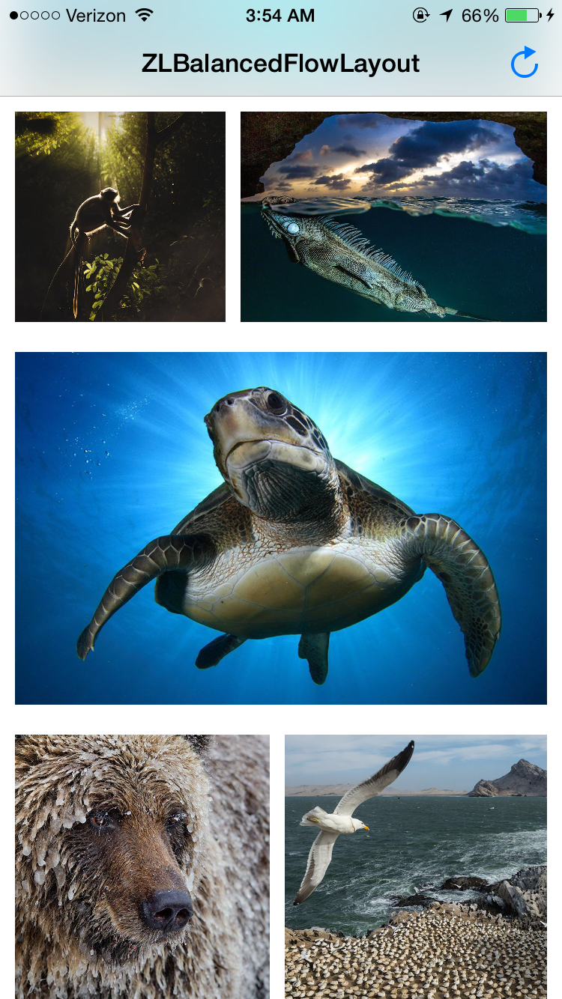
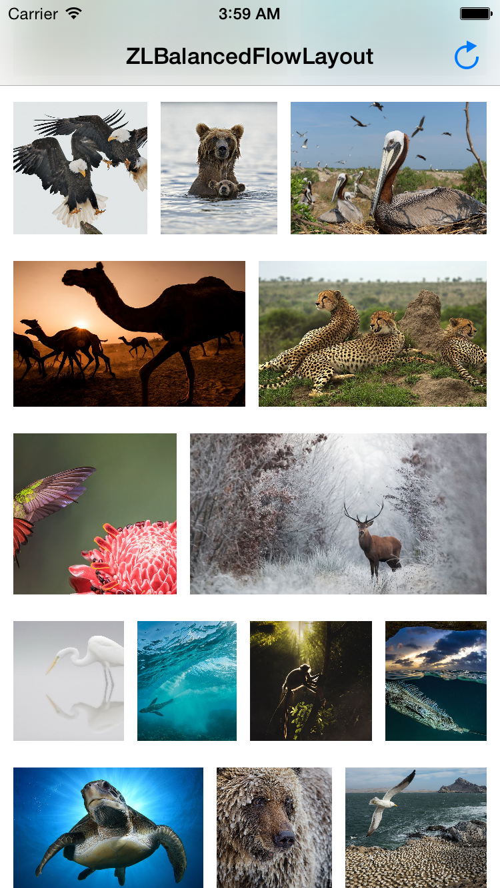

ZLBalancedFlowLayout
========================

A UICollectionViewFlowLayout subclass that scales items to take up space, optimized for large item set, inspired by NHBalancedFlowLayout.

Previews
---

Usage
---
Checkout the demo app for an example.

ZLBalancedFlowLayout supports all properties of UICollectionViewFlowLayout and the corresponding delegate methods, including `minimumLineSpacing`, `minimumInteritemSpacing`, `sectionInset`, etc.

Use `rowHeight` to adjust the item height.

Benchmarks
---
ZLBalancedFlowLayout uses dynamic programming techniques to find the optimal partition of cells upfront.
The benchmarks are based on timings of `prepareLayout`

###iOS simulator

NumSections|NumItemPerSection|ZLBalancedFlowLayout|UICollectionViewFlowLayout
-|-|-|-
1|100|0.0160560011863708|0.000555038452148438
1|1000|0.228259027004242|0.0039139986038208
1|3000|1.20643001794815|0.0141730308532715
10|100|0.158486008644104|0.0039370059967041
10|1000|2.26102298498154|0.0399309992790222
100|100|1.60317003726959|0.0364070534706116
100|1000|21.678355038166|0.385994970798492

###iPhone 6

NumSections|NumItemPerSection|ZLBalancedFlowLayout|UICollectionViewFlowLayout
-|-|-|-
1   | 100   | 0.0517209768295288 | 0.00196903944015503
1   | 1000  | 0.565874993801117 | 0.0149750113487244
1   | 3000 | Recursion overflow, not yet tail optimized | 0.0408549904823303
10  | 100   | 0.523442983627319 | 0.0157199501991272
10  | 1000  | 5.28750801086426 | 0.130671977996826
100 | 100   | 4.89241003990173 | 0.118210017681122

Todos
---
- [ ] Support horizontal direction

Requirements
---
- iOS 6 or higher.
- Automatic Reference Counting (ARC).

License
---
ZLBalancedFlowLayout is available under MIT license. See the LICENSE file for more info.

Photo Credits
---
The photos in the demo app are selected from [National Geographic](photography.nationalgeographic.com)
- [Bodybuilders](http://photography.nationalgeographic.com/photography/photo-of-the-day/social-worker-ants-macro/)
- [Fair Day’s End](http://photography.nationalgeographic.com/photography/photo-of-the-day/camels-pushkar-fair-india/)
- [The Lookout](http://photography.nationalgeographic.com/photography/photo-of-the-day/cheetah-rest-south-africa/)
- [Gray Langur at Rest](http://photography.nationalgeographic.com/photography/photo-of-the-day/gray-langur-anand-india/)
- [Horses in the Highlands](http://photography.nationalgeographic.com/photography/photo-of-the-day/iceland-highlands-horses-herd/)
- [Incoming Flight](http://photography.nationalgeographic.com/photography/photo-of-the-day/bald-eagles-birds-talons/)
- [Leaps and Bounds](http://photography.nationalgeographic.com/photography/photo-of-the-day/otter-running-united-kingdom/)
- [Those Lion Eyes](http://photography.nationalgeographic.com/photography/photo-of-the-day/lion-kalahari-south-africa/)
- [In for a Treat](http://photography.nationalgeographic.com/photography/photo-of-the-day/coppery-headed-emerald-hummingbird/)
- [Napoleon Invasion](http://photography.nationalgeographic.com/photography/photo-of-the-day/napoleon-wrasse-coral/)
- [Turtle Power](http://photography.nationalgeographic.com/photography/photo-of-the-day/green-turtle-tenerife/)
- [Home to Roost](http://photography.nationalgeographic.com/photography/photo-of-the-day/gulls-mercury-island-namibia/)
- [Seal Dive](http://photography.nationalgeographic.com/photography/photo-of-the-day/fur-seal-dive-peschak/)
- [Bird Bank](http://photography.nationalgeographic.com/photography/photo-of-the-day/brown-pelican-atlantic-musi/)
- [Cold Encounter](http://photography.nationalgeographic.com/photography/photo-of-the-day/deer-winter-snow-frost/)
- [Big and Little Dipper](http://photography.nationalgeographic.com/photography/photo-of-the-day/bear-swimming-kurile-russia/)
- [Call of the Wild](http://photography.nationalgeographic.com/photography/photo-of-the-day/lioness-mother-maasai-mara/)
- [Where the Antelope Play](http://photography.nationalgeographic.com/photography/photo-of-the-day/impala-wildlife-delta-botswana/)
- [Swimming for Supper](http://photography.nationalgeographic.com/photography/photo-of-the-day/monkey-water-phuket-thailand/)
- [50 Shades of Ray](http://photography.nationalgeographic.com/photography/photo-of-the-day/mobula-rays-mexico-underwater/)
- [Croc Tail](http://photography.nationalgeographic.com/photography/photo-of-the-day/american-crocodile-caribbean-sea/)
- [Tip of the Iguana](http://photography.nationalgeographic.com/photography/photo-of-the-day/green-iguana-bonaire-caribbean/)
- [North Star](http://photography.nationalgeographic.com/photography/photo-of-the-day/polar-bear-rudolf-russia/)
- [Tree Pose](http://photography.nationalgeographic.com/photography/photo-of-the-day/owl-stretching-reserve-kuwait/)
- [Winter Layers](http://photography.nationalgeographic.com/photography/photo-of-the-day/grizzly-bear-yukon-nicklen/)
- [Huffing Puffins](http://photography.nationalgeographic.com/photography/photo-of-the-day/puffins-duel-skomer-green/)
- [The Elegance of the Egret](http://photography.nationalgeographic.com/photography/photo-of-the-day/egret-fog-reflection/)
- [Here Be Dragons](http://photography.nationalgeographic.com/photography/photo-of-the-day/komodo-indonesia-untherthiner/)
- [Walrus Interrupted](http://photography.nationalgeographic.com/photography/photo-of-the-day/atlantic-walrus-greenland-nicklen/)
- [Crying Wolves](http://photography.nationalgeographic.com/photography/photo-of-the-day/timber-wolves-indiana/)-
